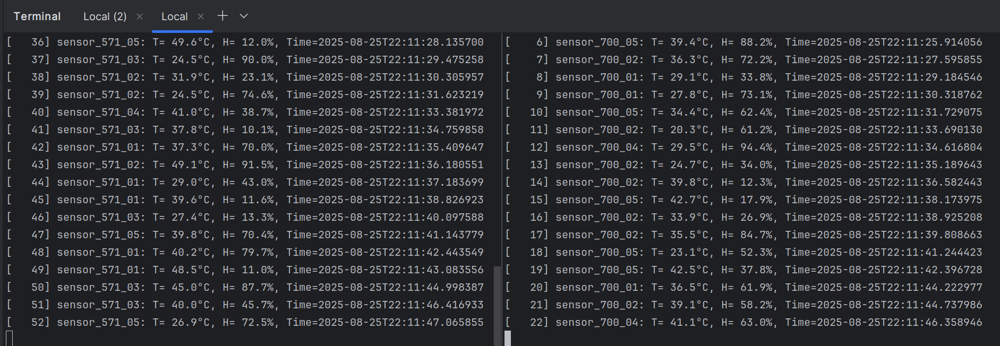
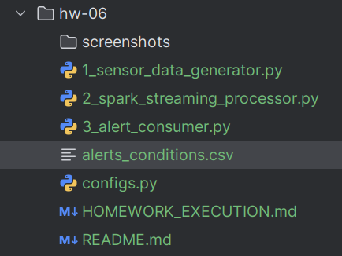
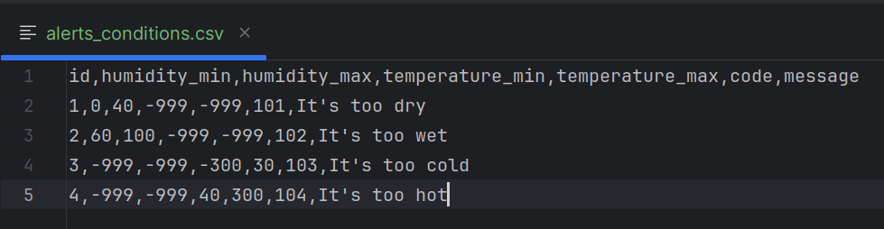
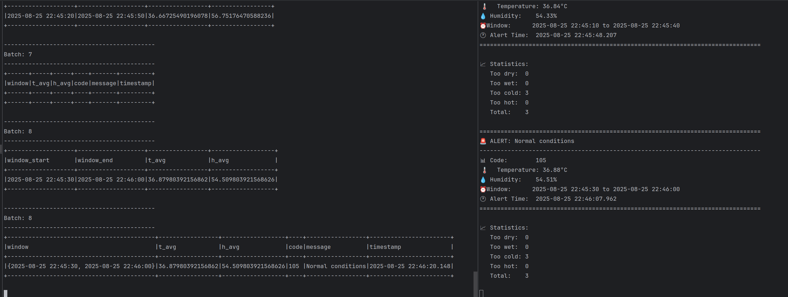
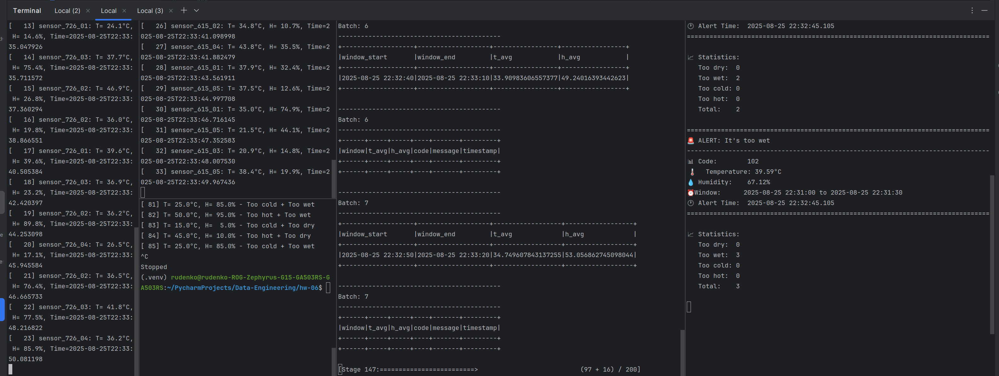
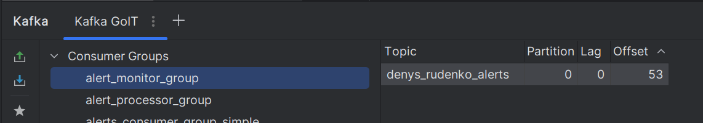

# HW-06: Spark Streaming + Kafka = Алерти в реальному часі 🚀

## Що це робить?

Система моніторить датчики температури та вологості і створює алерти коли щось не так.

## Швидкий старт (5 хвилин)

### Крок 1: Створіть топіки в Kafka
```bash
python 0_create_topics.py
```

### Крок 2: Запустіть ВСЕ в окремих терміналах

**Термінал 1 - Перший генератор датчиків:**
```bash
python 1_sensor_data_generator.py
```

**Термінал 2 - Другий генератор датчиків:**
```bash
python 1_sensor_data_generator.py
```

**Термінал 3 - Spark обробка:**
```bash
python 2_spark_streaming_processor.py
```

**Термінал 4 - Перегляд алертів (опціонально):**
```bash
python 3_alert_consumer.py
```

### Крок 3: Чекайте алерти (~30 секунд)

Spark збирає дані у вікнах по 30 секунд і генерує алерти.

---

## Скріншоти виконання 📸

### 1. Два генератори працюють одночасно



**Що бачимо:** Два термінали з різними Instance ID (952 і 972) генерують дані датчиків одночасно.

### 2. Spark Streaming обробляє дані



**Що бачимо:** Spark агрегує дані у вікнах (window) та обчислює середні значення температури і вологості.

### 3. Генерація алертів



**Що бачимо:** Коли середня температура > 38°C, генерується алерт "It's too hot" з кодом 104.

### 4. Алерти в Kafka



**Що бачимо:** Consumer група `alert_monitor_group` читає 53 алерти з топіку `denys_rudenko_alerts`.

### 5. Детальний вигляд алертів



**Що бачимо:** Форматовані алерти з усіма деталями - температура, вологість, час, повідомлення.

### 6. Підтвердження в Kafka Plugin



**Що бачимо:** PyCharm Kafka plugin показує що алерти успішно записані в топік.

---

## Як це працює? 🤔

### Потік даних:
```
Датчики → Kafka → Spark Streaming → Алерти → Kafka → Споживач
         ↓         ↓                ↓         ↓
   sensor_data   агрегація      фільтрація  alerts
```

### Що робить кожен файл:

| Файл | Що робить | 
|------|-----------|
| `1_sensor_data_generator.py` | Імітує IoT датчики, шле дані в Kafka |
| `2_spark_streaming_processor.py` | Читає дані, рахує середні, генерує алерти |
| `3_alert_consumer.py` | Показує алерти з Kafka |
| `alerts_conditions.csv` | Умови для алертів (коли температура чи вологість не ОК) |

### Параметри вікон:
- **Вікно**: 30 секунд
- **Зсув**: 10 секунд  
- **Watermark**: 5 секунд

### Типи алертів:

| Код | Умова | Повідомлення |
|-----|-------|--------------|
| 101 | Вологість < 30% | It's too dry |
| 102 | Вологість > 70% | It's too wet |
| 103 | Температура < 35°C | It's too cold |
| 104 | Температура > 38°C | It's too hot |
| 105 | Все в нормі | Normal conditions |

---

## Проблеми та рішення 🔧

### Алерти не з'являються?
- Почекайте 30+ секунд (розмір вікна)
- Запустіть `test_extreme_generator.py` для екстремальних значень
- Перевірте що всі 3 компоненти працюють

### Батчі порожні?
- Нормально для перших 30 секунд
- Перевірте що генератори працюють
- Перезапустіть Spark

### Помилка з Kafka?
```bash
python 0_create_topics.py  # Створити топіки
```

---

## Структура проекту 📁

```
hw-06/
├── configs.py                    # Налаштування Kafka
├── alerts_conditions.csv         # Умови алертів
├── alerts_conditions_demo.csv    # Демо умови (легші для тестування)
├── 0_create_topics.py           # Створення топіків
├── 1_sensor_data_generator.py   # Генератор даних
├── 2_spark_streaming_processor.py # Spark обробка
├── 3_alert_consumer.py          # Перегляд алертів
├── test_extreme_generator.py    # Тест з екстремальними значеннями
└── screenshots/                 # Скріншоти виконання
```

---

## Результат ✅

Система успішно:
1. ✅ Генерує дані від кількох датчиків
2. ✅ Агрегує дані у sliding windows
3. ✅ Фільтрує за умовами з CSV файлу
4. ✅ Записує алерти в Kafka топік
5. ✅ Дозволяє моніторити алерти в реальному часі

**Домашнє завдання виконано!** 🎉